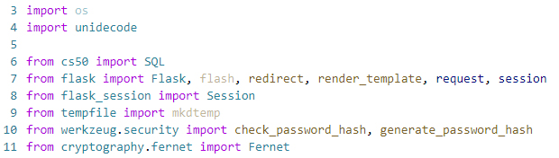
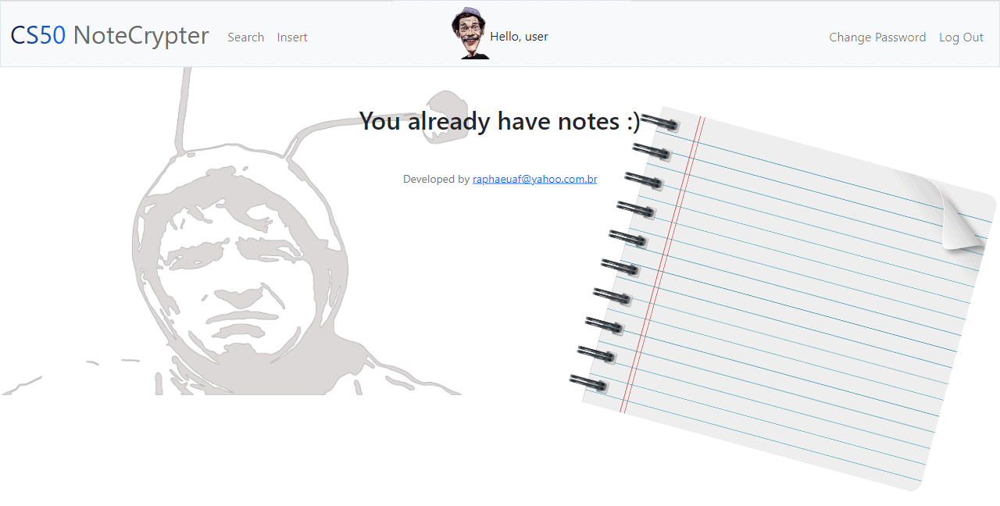
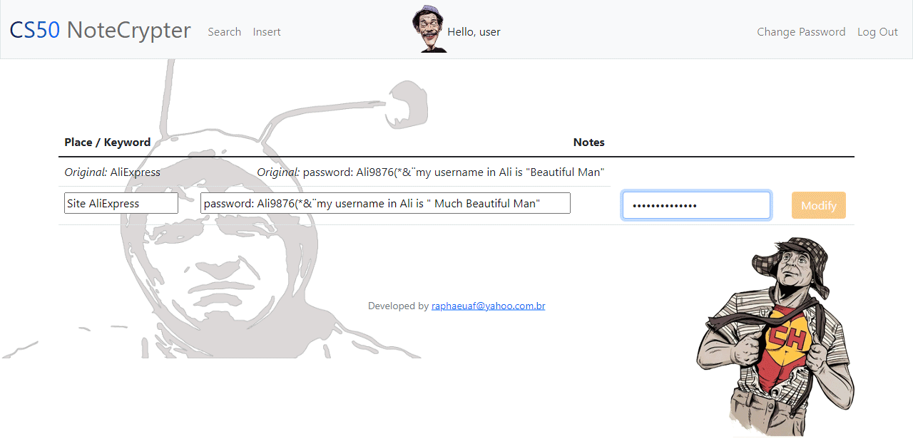
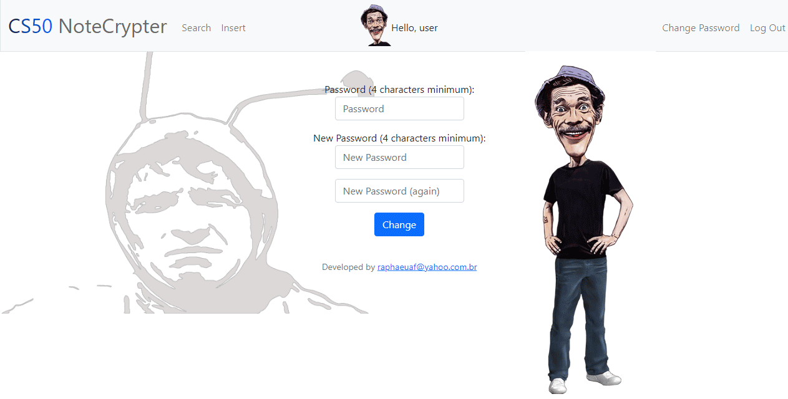

# NoteCrypter
#### Video Demo:  <https://www.youtube.com/watch?v=OloFyei49xo>
#### Description:

## Index

* [Title and Logo](#Title-and-Logo)
* [Badges](#badges)
* [Index](#index)
* [Project Description](#project-description)
* [Project Status](#project-status)
* [Application, Features and Requirements](#application-,-features-and-requirements)
* [Developer](#developer)
* [License](#license)
* [Conclusion](#conclusion)

## Project Description

 The main idea is to implement a manager password. There are a lot of them , but I wanted to cover one lack with
this my project: the simplicity to use an ordinary notepad to write down many passwords (or any other notes) without
 lose the safety that current managers provide. Whereas the simplicity for usage is to me, the second part was with
 <b>Fernet</b>, the well known and well reputed encrypter for <b>Python</b>. I had to adapt some features, which I am going to describe them throughout this document. 

## Project Status
I have tested it a lot, but I think that my project needs to be tested by other people. I'm developing this project to get my CS50's Certificate. Before the course, I had no idea if programming was to eat or to drink... So, it might be expected that my (in)experience leaves some lacks, but I also recognize that I put a lot of energy and effort in this application and it deserves a good grade, from 0 to 10, between 5 and 6 :). I think that my project got really interesting and, taking away all the animated images and fluffs, many different and technical concepts that I (just) learned from CS50 were applied in it.

## Application, Features and Requirements

I built my project with <b>Flask</b> and all of your "partners". So, there's a lot of <b>Python</b>, a few of <b>JavaScript</b> (in the part that the program detects that the password and confirmation are different or in the part that the program detects an username already exists, for example), there's quite <b>HTML</b>, <b>SQL</b> and <b>JINJA</b>, as well as <b>CSS</b> too. There's also somewhat of <b>photoshop</b> to make my animated gifs.

As requirements to run, my project needs:

- `Flask`: "pip install Flask".
- `from cs50 import SQL`: I used the CS50 library to manipulate SQL with Python.
- `from werkzeug.security import check_password_hash, generate_password_hash`: I needed to work with hash, so I imported these functionalities.
- `from cryptography.fernet import Fernet`: Fernet, of course.
- `import unidecode`: In order to standardize the data and facilitate the search.
- `from tempfile import mkdtemp`: To support the sessions that are created during the usage.

Ladies and Gentlemen, with you, my project: Be patient, please :)

### <ins>The first contact</ins>:

 Below we have the first contact with the application. To use it is required login (username and password). This password will be exhaustively required in order to keep the high level of security and to force the user to know, by heart, his/her <b>Master key / Password</b>.

 If there isn't register, register then: 

### <ins>The first adaptation</ins>:
With my application, comes a database file called "plaintext.db". This file contains 4 columns:
- `id`: The user's id, like a register number.
- `username`: which might be explored few times, since it is an individual application. This column stores/keeps the username.
- `hash`: this column keeps the hash generated by the password that user typed in.
- `userkey`: this one is kind of interesting and here is my first little trick with <b>Fernet</b>. Per documentation, <b>Fernet</b> requires a certain default for the key that will be used for encryptation and, to avoid big issues, it provides a function that do exactly this in a random way, ensuring the big size and the difficulty of the key.

 It doesn't make sense if I encrypt all the data and keeps the key opened. Here's, then, the trick: the column "userkey" keeps part of the key and the another part is the password that the user registered. This password is the <b>Master Password</b>, the <b>Master Key</b> for all his/her another passwords/notes and, for that reason must be <b>big</b> and <b>difficult</b>. This <b>Master Key</b>, isn't saved/kept in any place.

 The operation that is made between the <b>userkey</b> (part of the random key generated by <b>Fernet</b> in the moment of new user's register) and the <b> Password </b> is a big field for the developer's creativity.

### <ins>The application's soul and the second adaptation</ins>:
In the moment that a user makes register, a new table is created inside of the database. This table is the soul of the project, that is, all of the work and the application were built in order to make this table work properly. The table is not filled, up to the user insert notes inside it. It has 4 columns too:
- `id`: The insertion's id, like a register number for each new row.
- `place_keyword`: I tryied to think about a more intuitive name for "login", "names from the places that I have account". This column's name was my best. This place is to type in for which thing or place the next column is directed.
- `notes`: Here is for password or for anything that we want to type or write down, like passwords, secret questions, complement codes, etc.
- `temp`: Here's my second trick with <b>Fernet</b>. All of data of last two columns are encrypted, but how do I make to organize them alphabetically, for example? Or how do I make to show only the field that user wants? The temp column is used for this, the application prints all the "place_keyword" data in that column during the processing. In this way it is possible to manage the data according to user's preference. Of course, after that, all data is deleted and the temp column will be ever empty. If there isn't any entry, all table is empty too:

For the table with data, we'll see it soon.

### <ins>After the register and login</ins>:
After the register and login, there isn't any entries yet:

If there was...

### <ins>Inserting a row</ins>:
If there isn't data, what rests to us is to put, then, some notes. It'll be necessary three fields, <b>place/keyword</b>, <b>notes</b> and <b>password / Master Key</b>. This last will be required every time that we want to make a change or query. It might be annoying, but it'll keep the safety level in a high position.

Let's suppose that I entried the following inputs/rows/notes:

- `place_keyword`: ebay
- `notes`: password: 12345 login: myself@google.com

Then following:

- `place_keyword`: AliExpress
- `notes`: password: Ali9876(*&¨my username in Ali is "Beautiful Man"

And following:

- `place_keyword`: Bank of Boston
- `notes`: pass: 12345678 my credit card number is 4444555544445555 Visa and code is 123

And Lastly:

- `place_keyword`: Bank of Banks
- `notes`: I have no account here, sorry. But I would like to

### <ins>Searching</ins>:
The user can search for all entries leaving the place/keyword field empty, or search for a specifc entry filling the field:

If the place/keyword field is empty, all entries are displayed on screen in table format:

What about our notepad? How this table above is written on our database? There's so much characters (thanks to <b>Fernet</b>), that it was difficult to manupulate the image to print here:

If the place/keyword field is filled, all entries that have some relation with what was typed are displayed:

If there isn't any entry yet, there is no data to show:

### <ins>Modifying a row</ins>:
Notice when there is a data to show, two buttons appear as options: <b>Modify</b> and <b>Delete</b>. When the button <b>Modify</b> is clicked, we can change what was typed in a previows entry:

If a modification is made, the position that the modified row is shown could be changed according its new alphabetical order:

### <ins>Deleting a row</ins>:
If the user want to delete an entry, the application ask to him/her password, as usual, but a marcation in a checkbox to avoid accidental losses is required too:

### <ins>Changing password</ins>:

I had written this text about change:

<em>"Nothing much special here. It does what it describes, it gives the oportunity to user changing (or turn stronger) his/her Master Key. Maybe would be more interesting if I had implemented a change of userkey in this session too, making the "Fernet" generate a new randomic key with newpassword. But I just thought about that now, that I'm writting this document:"</em>

I was really, really, but really (a lot!) wrong! The <b>userkey</b> must be changed. If this doesn't occur, all the data encrypted with <b>old key + old password</b> won't be opened / decrypted with <b>new password + old key</b>. Trivial, right? Not to me, but I fixxed that!

But, there was a <b>but</b>... If I set the "team" with <b>new password + new userkey</b>, what will happen with all my notes? All of them were encrypted with a <b>old key</b> that was composed by <b>old password + old userkey</b>. Ok, I could remember my <b>old password</b>, but what about the <b>old userkey</b>? That is random! The things got worse!

I fixxed that too... Now, every time that the user changes the password, a new userkey is generated and all entries are opened / decrypted with old key for the last time and, then, encrypted again but, from now on, with new key! :)... I am proud of that.

This part deserved much more attention that I could imagine!

## Developer
I'm really honored in begin to make part of this world of programming. My name is Raphael Freitas. I'm Brazilian, I'm from Lorena (my city) São Paulo (my state) and my contact is raphaeuaf@yahoo.com.br.

## License
I think my work is free, right?

## Conclusion

I don't want to be tiring. I just want to thank <b>Harvard University</b> to open this oportunity of studying to people like me. I never could imagine studying programming (in/from Harvard!), even though I always want. <b>EDX / Harvard</b> provided it to me and I am really, really grateful.

Thanks to my family that I have abandoned these last weeks. My daughter is calling me "Raphael" and not "dad" anymore. I suspect that my wife calls me "amor" (love) because she forgets my name. Perhaps she thought that calling me "dad" would be stranger. Thanks to <b>CS50</b> for this too.

<b>Thanks to everyone</b> that will read this document and will be willing to help me, teach me. <b>I want to learn more</b> and I am available for growth / job opportunities.

Thank you all!

